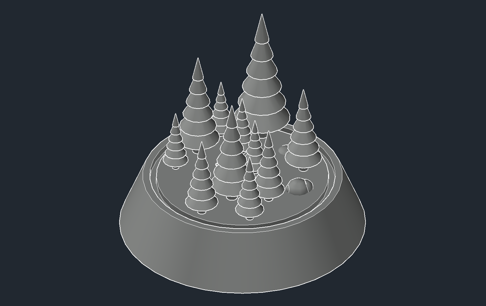
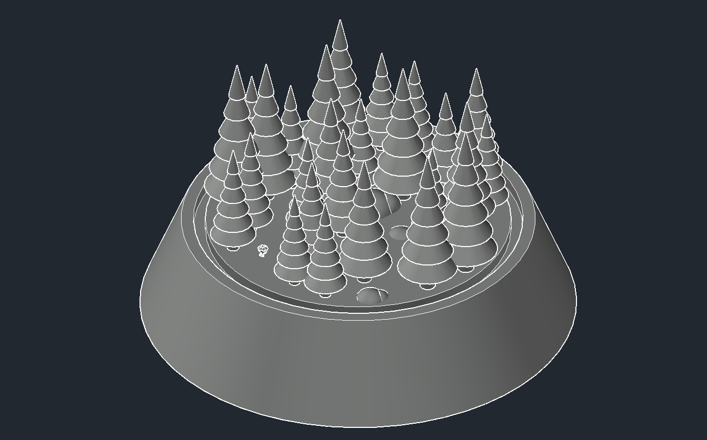
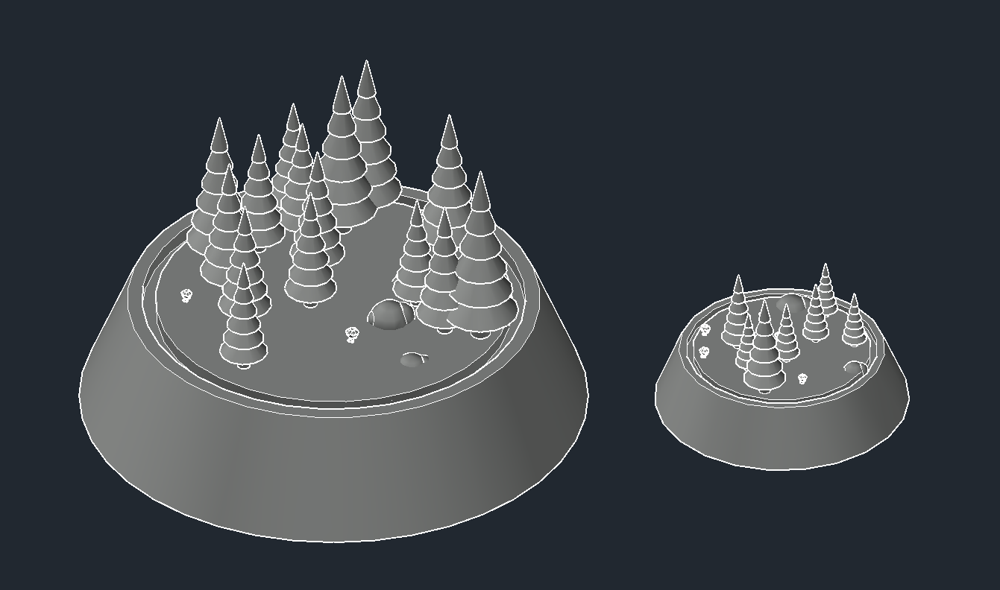
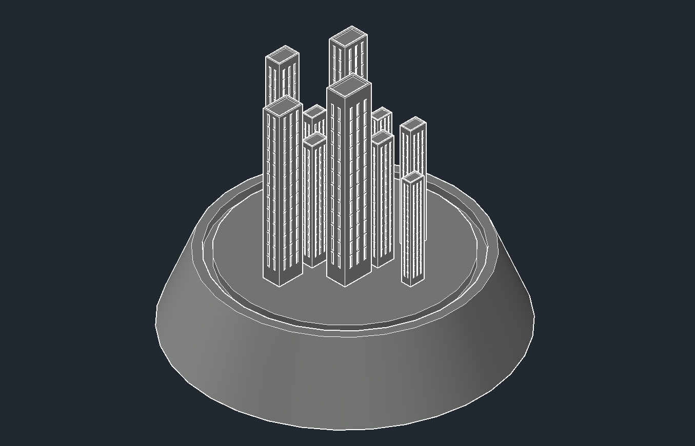
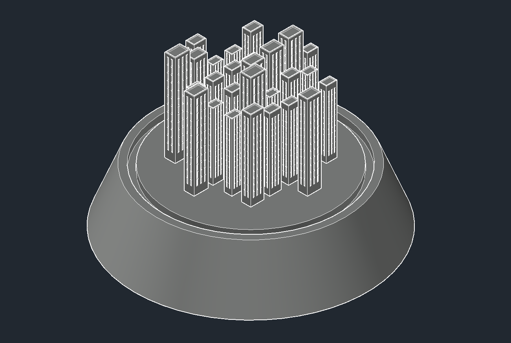
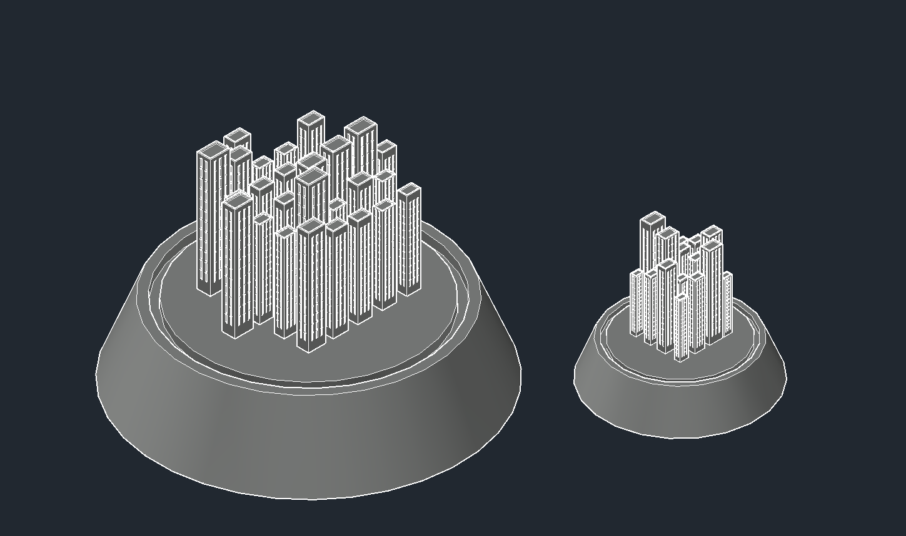

# Souvenir Generator

An AutoCAD plugin written in **AutoLISP + DCL** that procedurally generates a unique 3D souvenir model directly inside AutoCAD. Every run produces a different result.

## Overview

The user selects a size and a theme through a dialog box. The script then generates a fully 3D model — a shaped base populated with randomly placed and scaled objects, ready for rendering or 3D printing.

## Features

- **Dialog-driven UI** (DCL) — size input + theme selection
- **Two themes:**
  -  *Silent Forest* — randomized trees, rocks, and flowers scattered across the base
  -  *Modern City* — grid-placed skyscrapers with procedurally generated windows
- **Custom LCG random number generator** — seeded from system date/time and last cursor position, ensuring a unique result every run
- **Non-overlapping placement** — objects are placed with minimum distance checks to avoid clipping
- **Parametric scaling** — all geometry scales proportionally based on the chosen base diameter (250–500 mm)
- **Automatic environment setup** — switches to SW Isometric view, Shades of Grey visual style, disables grid/snapping

## Gallery

### Silent Forest theme
| Min diameter (250mm) | Max diameter (500mm) |
|---|---|
|  |  |

Side-by-side comparison:



### Modern City theme
| Min diameter (250mm) | Max diameter (500mm) |
|---|---|
|  |  |

Side-by-side comparison:



## How It Works

### Base
A truncated cone with a flat top platform, sized relative to the chosen diameter.

### Forest theme
Points are generated randomly within a circle using rejection sampling. Each point is assigned one of three object types:
- **Tree** (70% chance) — trunk + layered cone foliage, randomly scaled
- **Rock** (15% chance) — organic rock shape
- **Flower** (15% chance) — small decorative flower

### City theme
Points are generated on a grid fitted inside the base circle. Each point gets a **skyscraper** with:
- Randomly varied height and width
- Windows cut into all four faces via Boolean subtraction
- An inset top section for architectural detail

## Files

```
├── souvenir_generator.lsp   # Main script — all geometry and logic
└── souvenir_generator.DCL   # Dialog definition — UI for user input
```

## Requirements

- AutoCAD (any version supporting AutoLISP and DCL)
- DCL file must be placed at `C:/VLISP/DCL/souvenir_generator.DCL`

## Usage

1. Copy the .lsp file anywhere convenient
2. Copy the .DCL file to `C:/VLISP/DCL/` and rename it to `souvenir_generator.DCL` (the script expects this exact path and filename)
3. In AutoCAD, load the script:
   ```
   (load "C:/path/to/souvenir_generator.lsp")
   ```
4. Run the command:
   ```
   souvenir_generator
   ```
5. In the dialog — enter a base diameter (250–500 mm) and select a theme
6. The model generates automatically in the current drawing

## Dialog

| Field | Description |
|-------|-------------|
| Base diameter | Size of the souvenir base in mm (250–500) |
| Silent Forest | Populates the base with trees, rocks, and flowers |
| Modern City | Populates the base with a procedural skyline |

## Notes

- Each generation is unique due to the time/cursor-seeded random generator
- Last used settings are remembered within the session
- The model is intended for rendering or export to STL for 3D printing
